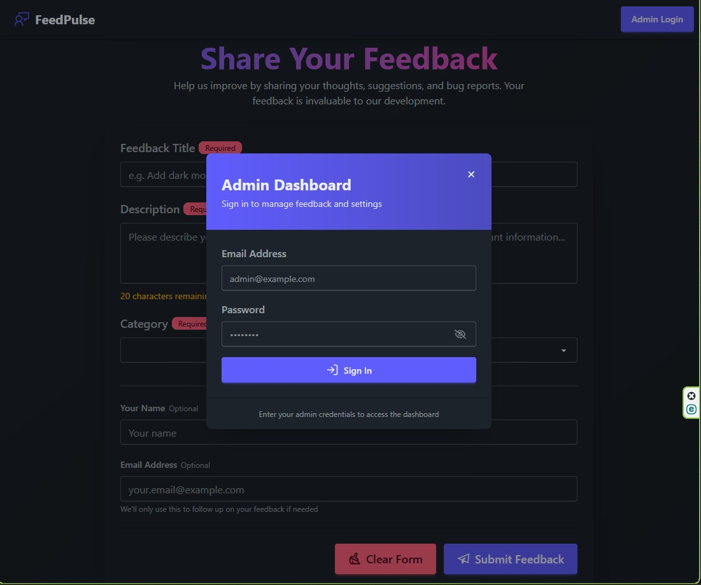
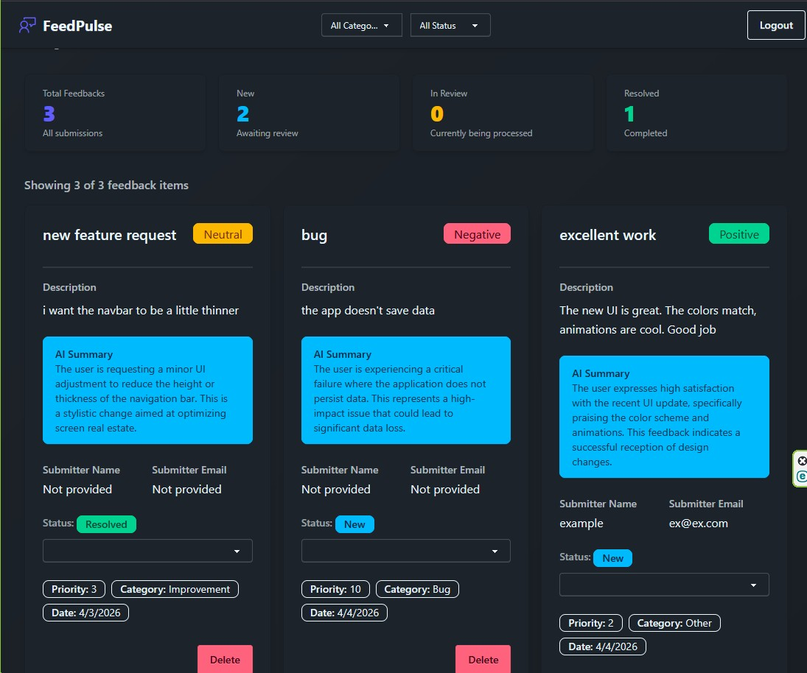
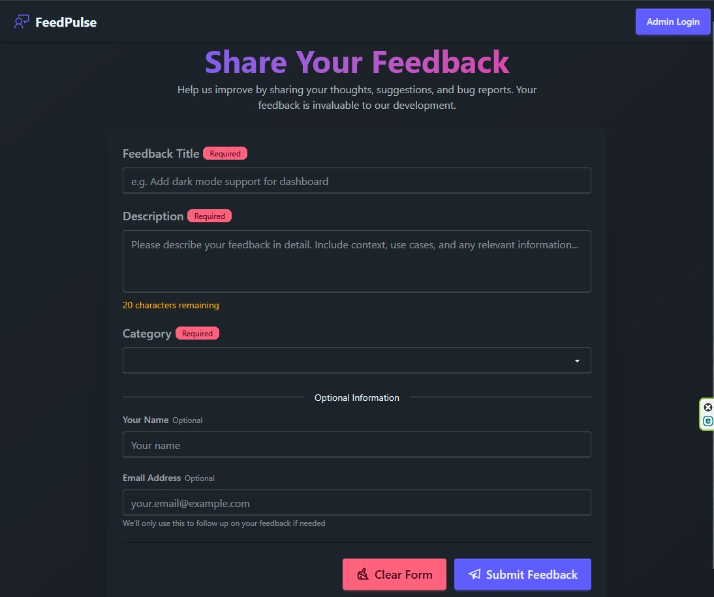

# FeedPulse Frontend

## Description
FeedPulse is a web app designed to help users submit feedback easily and enable admins to view, analyze, and manage all feedback submissions through a secure dashboard. The system leverages Gemini AI to analyze feedbacks.

## Tech Stack

- **React** - For UI
- **Vite** - Build tool and dev server
- **DaisyUI** - Prebuilt UI components and support for LLM UI generation
- **React Router** - For client-side routing
- **Axios** - For API handling
- **React Hot Toast** - Toast notifications
- **React Icons** - Icon library


## How to Run Locally

### 1: Clone the Repository
```bash
git clone <repository-url>
cd (folder name)
```

### 2. Install Dependencies
```bash
npm install/ npm i
```

### 3. Create Environment Variables
Create a `.env` file in the frontend root directory:
```env
VITE_BASE_URL=(your backend API base URL)
```

### 4. Start the frontend
```bash
npm run dev
```
### 5. Use Postman to add admin details to MongoDB (For admins)
```bash
- Configure the backend and run it.
- Use backend base url/api/auth/register as the URL
- Create a POST request with body(raw json),
{  
    "email": "admin email",
    "password": "admin password"
}
```

## Screenshots
- Admin Login modal


- Admin Dashboard


- Landing Page


## If I had more time to build, I'd build 
- a page where all the feedback are shown with status to the users without needing to sign in. It would let users know the status of their feedbacks, also dulicate feedbacks will be reduced because of it.
